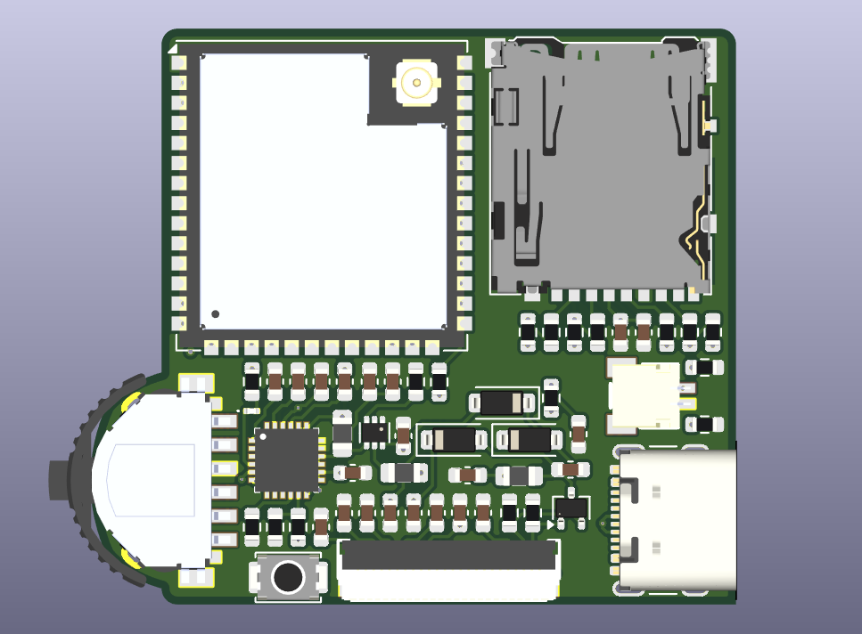
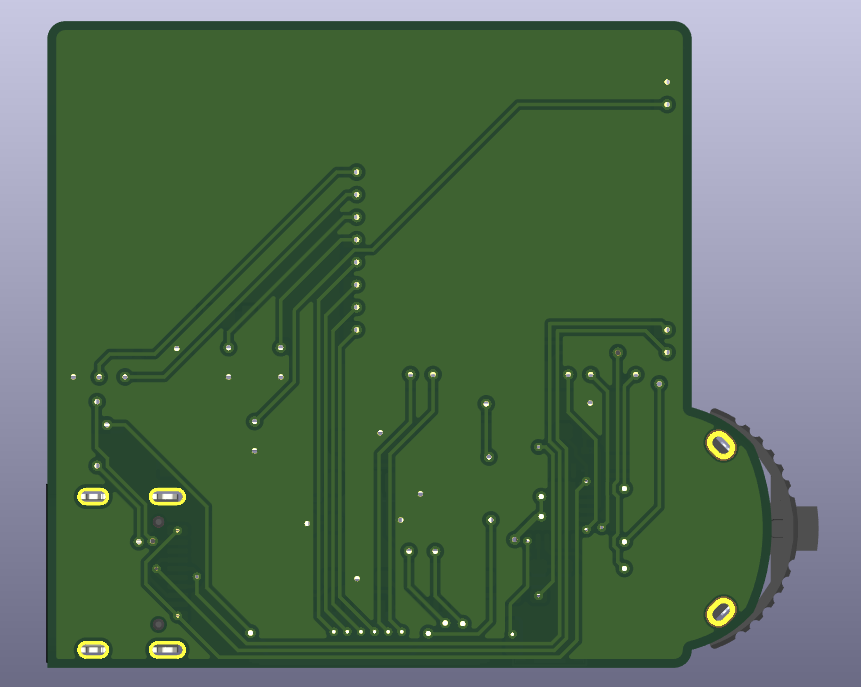

# ESP32 E-Paper Board

Eine kompakte, selbst entwickelte ESP32-S3-Platine für portable Anwendungen mit E-Paper-Display, microSD-Karte, Navigationstaster und LiPo-Akku.

## Features

- ESP32-S3-WROOM-1U
- 1.54" E-Paper Display
- microSD-Karten-Slot
- 3-Wege-Navigationstaster
  - UP
  - DOWN
  - PUSH
- USB-C für Stromversorgung, Programmierung und serielle Kommunikation
- 3.7 V LiPo-Akku
- Integrierter LiPo-Ladecontroller
- 3.3 V Spannungsversorgung
- Kompakte Bauform

## 3D-Modell

### Oberseite

### Unterseite

## Verwendete Komponenten

| Komponente | Beschreibung |
|---|---|
| ESP32-S3-WROOM-1U | Hauptcontroller |
| GDEY0154D67 | 1.54" E-Paper Display |
| BQ25896 | LiPo-Ladecontroller |
| TPS62843 | 3.3 V Buck-Converter |
| TS43-135255-10-BK-200-SMT-TR | Navigationstaster |
| USB4105 | USB-C Anschluss |
| SM02B-SRSS-TB(LF)(SN) | JST-Akkuanschluss |

## Dokumentation

Die verwendeten Datenblätter befinden sich im Ordner [`Docs`](./esp32_epaper_board/Docs/).

Enthalten sind unter anderem die Datenblätter für:

- [ESP32-S3-WROOM-1U](./esp32_epaper_board/Docs/ESP32-S3-WROOM-1U-N8_Espressif_Systems.pdf)
- [GDEY0154D67 E-Paper Display](./esp32_epaper_board/Docs/GDEY0154D67-new.pdf)
- [BQ25896 LiPo-Ladecontroller](./esp32_epaper_board/Docs/bq25896.pdf)
- [TPS62843 Spannungsregler](./esp32_epaper_board/Docs/tps62843.pdf)
- [TS43-135255-10-BK-200-SMT-TR Navigationstaster](./esp32_epaper_board/Docs/TS43-135255-10-BK-200-SMT-TR_Same_Sky.pdf)
- [USB4105 USB-C Anschluss](./esp32_epaper_board/Docs/usb4105.pdf)
- [SM02B-SRSS JST Anschluss](./esp32_epaper_board/Docs/SM02B-SRSS-TB(LF)(SN)_JST_Sales.pdf)

Die übrigen Dateien im `Docs`-Ordner enthalten zusätzliche Datenblätter und Referenzinformationen für das PCB-Design.